# README

> 배포서버
>
> http://i4d102.p.ssafy.io/


## SSAC (SSAFY Sports as Clalender)

> 캘린더에 관람하고자 하는 모든 종목의 스포츠 경기를 ‘큐레이팅’ 하고, 그 일정을 팔로워들과 공유하는 SNS


## 프로젝트 기획배경

1. 스포츠 경기를 관람할 때 마다 함께 관람할 사람을 찾는 것이 번거로워서, 
   내가 보고자 하는 경기와 친구가 보고자 하는 경기를 공유함으로써 편하게 관람 
   메이트를 찾기 위해서
2. 원래는 종목 별로 경기 일정을 따로 확인해야 하는데, 종목 상관없이 내가 
   관심있는 팀의 일정을 한꺼번에 확인하기 위해서


## 프로젝트 상세 소개

인증이 된 사용자는 캘린더에 사용자가 관심 등록해 놓은 스포츠 팀들의 경기 일정을 종목(축구, 야구, 롤챔스) 상관없이 한꺼번에 확인할 수 있으며, 카테고리 별로도 확인할 수 있습니다.

 팔로우한 사용자들과 함께 서로의 경기 관람 스케줄을 공유하며, 실시간으로 채팅을 하며 의견을 공유할 수 있습니다. 

그리고 관심 등록한 팀 외에 다른 팀들을 추천 받을 수 있습니다. 순위 탭을 누르면 팀 순위나 개인 순위를 확인할 수 있습니다. 승부 예측하여 승부 결과를 맞힌 경우, 포인트를 획득하게 됩니다. 


## 팀원 정보 및 업무 분담 내역

#### 팀장 : 이지원

* 


#### 팀원 : 박노정

* 


#### 팀원 : 이경연

* 


#### 팀원 : 백규태

* 프론트엔드
  * 기본적인 화면 구성
    * 다른 프론트엔드 팀원들이 보기쉽게 Vue 프로젝트 틀 잡기
  * 스케쥴
    * vuetify의 캘린더 기능을 활용하여 경기들을 월별로 보기 쉽게 정리
    * 간단한 식을 이용하여 베팅 시스템 구축
  * 뉴스
    * 크롤링한 정보를 종목별로 리스트로 나타내어 뉴스의 원본 링크에 연결
  * 랭킹
    * 크롤링한 정보를 종목별로 나타내어 화면에 나타냄


#### 팀원 : 이은지

* 


## 목표 서비스 구현 및 실제 구현 정보

> 개발 도구 : Java, Spring Boot, MySQL,Web Socket, Vue, Vuetify, css, html

#### 통합 스케줄

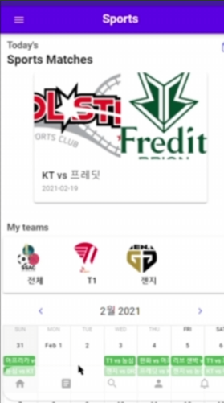


* 로그인을 하게 되면 가장 먼저 보이는 메인 페이지
* 당일 경기일정
  * 당일 My Team 설정한 팀 일정을 보여줍니다.
  * 메인 페이지 상단에 보여줍니다.
  * 캐러셀, 카드를 통해서 한눈에 잘 보이도록 구현했습니다. 
* 필터링 스케줄
  * My Team들의 모든 경기일정을 하단부 달력에서 확인할 수 있습니다.
  * 중단에 위치한 팀 로고모양의 필터를 통해 해당팀의 경기일정을 끄고 킬 수 있습니다. 

#### 베팅-1

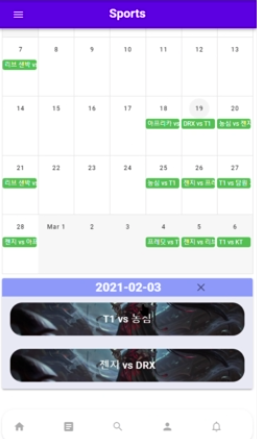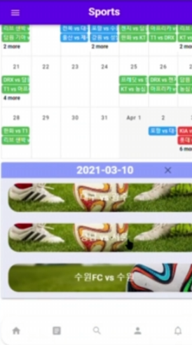


* 달력을 누르면 달력 하단부에 해당 일의 경기 정보들을 보여줍니다.
  * 종목에 따라 배경을 바뀌게해 한눈에 보기 쉽도록 했습니다. 


#### 베팅-2

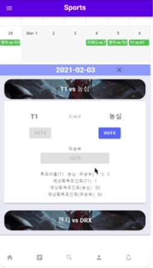

* 해당일의 경기 일정을 클릭하면 베팅창이 열립니다. 
  * 승 무 패 에 베팅을 할 수 있으며 예상획득포인트를 확인할 수 있습니다.


#### 순위 / 기사


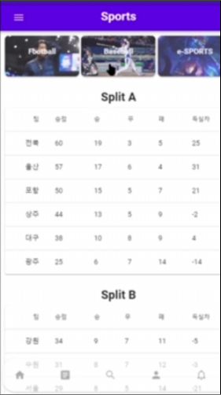


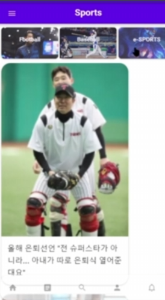


* 순위
  * 실시간 데이터 크롤링 서버를 통해 결과를 반영합니다. 
  * 상단의 버튼을 통해 각 종목별 순위를 확인 할 수 있습니다.
* 기사
  * 실시간 데이터 크롤링 서버를 통해 결과를 반영합니다. 
  * 상단의 버튼을 통해 각 종목별 기사를 확인할 수 있습니다.
  * 기사의 이미지와 헤드라인을 보여줘 대략적인 내용을 사용자에게 알려줍니다.
  * 클릭시 해당 기사페이지로 넘어갑니다.


#### 채팅

>당일의 경기들을 대상으로 채팅을 제공합니다.

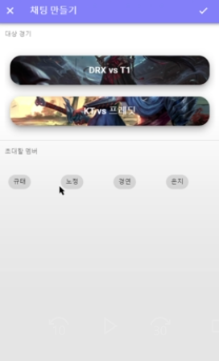

* 채팅 만들기
  * 대상경기는 당일 경기입니다.
  * 초대할 멤버는 사용자가 팔로우하고있는 회원입니다.

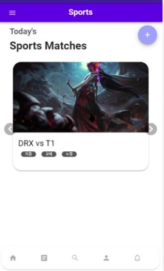

* 채팅 목록

  * 채팅 만들기 창을 통해 만든 채팅목록이 보여집니다. 

  * 이미지를 통해 해당 경기의 종목을 확인할 수 있습니다.

  * 카드안에 경기정보와 채팅방 멤버들의 목록이 담겨있습니다. 

    

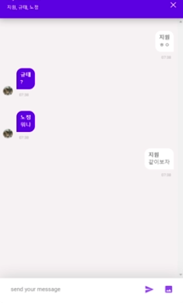

* 채팅방
  * Vue-Quick-Chat Api를 이용했습니다.
  * Web Socket 통신을 이용해 실시간 채팅을 구현했습니다. 


#### 검색

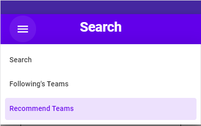

검색은 다음과 같이 3개의 탭으로 구성되어 있습니다.


* 검색창(Search)

  * 검색어 하나로 해당 검색어가 들어간 유저와 팀을 모두 검색해줍니다.

  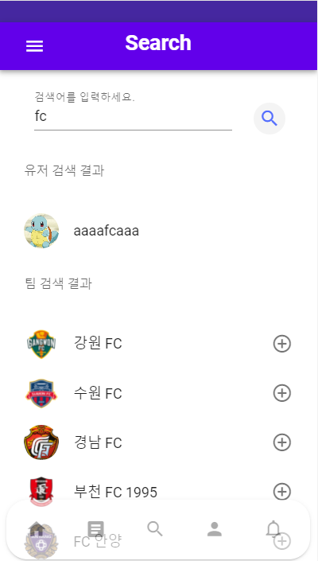

  * 유저 검색

  * 팀 검색

    * 팀 옆에 + 버튼을 누르면 마이팀(내가 관심있는 팀) 목록으로 들어가게됩니다.

    

* 친구의 팀 추천(Following's Teams)

  * 현재 내가 팔로우한 친구들이 마이팀(관심있는 팀)으로 등록해놓은 팀을 보여줍니다.
  * 친구들 중에 팔로우 수가 가장 많은 팀 순으로 상위 5개의 팀을 추천해줍니다.

  

* 새로운 팀 추천(Recommend Teams)

  * 설문지에 따라 설문을 진행하면, 그에 알맞는 팀을 추천해줍니다.

  * 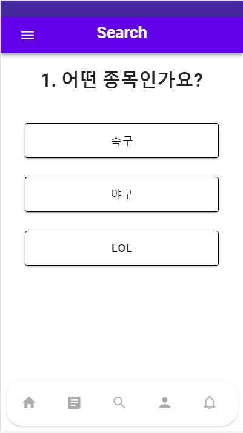

  * ```
    설문지 내용
    1. 어떤 종목인가요?
    축구, 야구, LOL
    
    2. 어떤 경기가 더 좋아요?
    화끈한 경기력이었지만 졌잘싸, 꾸역꾸역이지만 이겼으니 만족!
    
    3. 어떤 팀을 더 선호하나요?
    자주 이기는 상위권팀, 예측할 수 없는 중위권 팀, 반전을 꿈꾸는 하위권 팀
    
    4. 어떤게 더 좋아요?
    한 명의 슈퍼스타가 이끄는 팀, 모두가 헌신하는 팀
    ```

  


## ERD


## JIRA

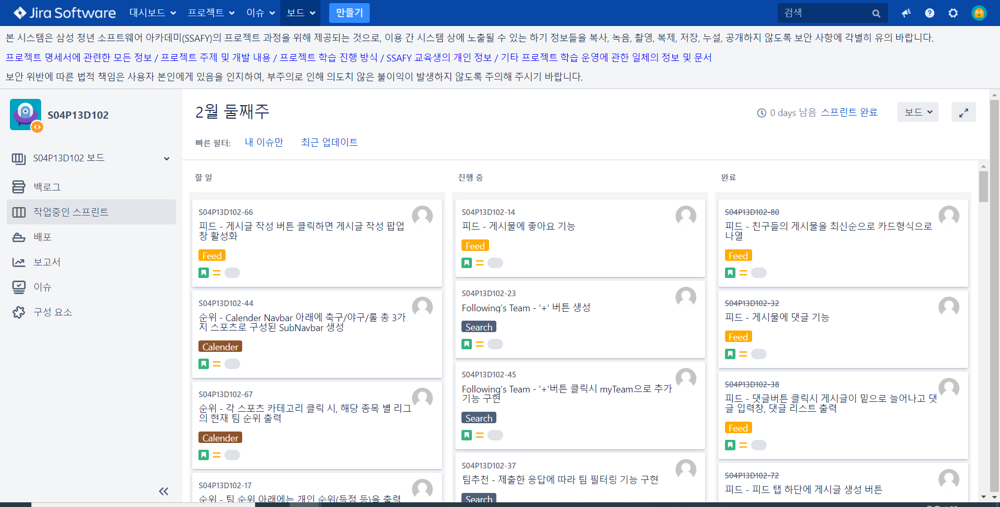


* 전체 할일
  * 백로그 창에서 각 파트별 개발업무를 이슈에 추가했습니다.
  * 공통 이슈의 경우 팀원에게 보고 후 추가했습니다.
* 스프린트 
  * 매 주 백로그의 이슈들 중 개발 대상들을 스프린트에 담았습니다.
  * 이를 통해 매 주 개발해야할 기능들을 쉽게 알 수 있었고 집중할 수 있었습니다.
  
    


## 프로젝트 소감

#### 팀장 : 이지원

* 


#### 팀원 : 박노정

* 


#### 팀원 : 이경연

* 


#### 팀원 : 백규태

*  이번 프로젝트를 하면서 소통이 매우 중요하다는 것을 알았습니다. 기본적으로 백-프론트간 소통이 잘 안되어 간단한 기능구현에도 오랜 시간이 걸렸고 프론트끼리의 소통도 부족하여 같이 공유하는 변수 명을 다르게 설정하는 등 여러 문제가 있었습니다. 소통문제는 프로젝트 중간에 팀원들이 뼈저리게 느껴 카톡이나 MM, 아침미팅에서 오늘의 할 일이나 이슈등을 서로 공유하며 해결했습니다.
   또 하나는 프로젝트 기술관리자의 부재가 있었습니다. 전체를 보는 사람이 없고 각자 자신의 역할에 치중하다보니 서로 불필요한 작업을 하거나 연동이 안되는 경우도 있었습니다. 예를들면 똑같은 API를 두 개 만들거나 피드에서 바로 다른 사람의 프로필로 넘어가는 부분 등 구현하기 간단한 몇몇 기능들을 빼놓은 점이 있습니다. 
   이번 경험을 통해 프로젝트를 좀 더 효율적으로 진행하는 방법을 조금이나마 깨달은 것 같습니다.


#### 팀원 : 이은지

* 

